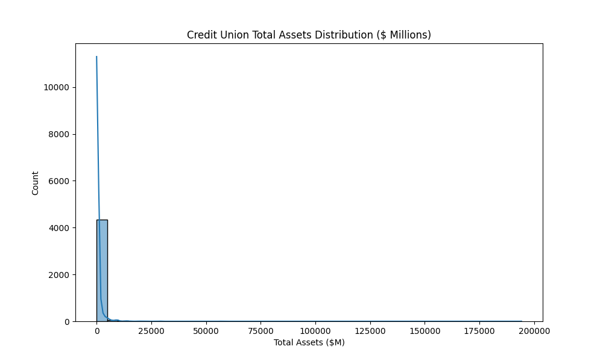
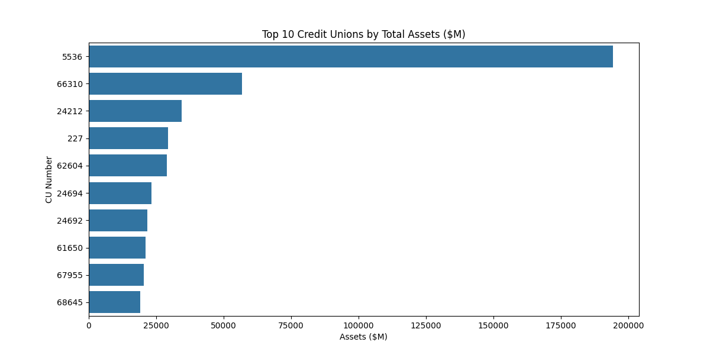
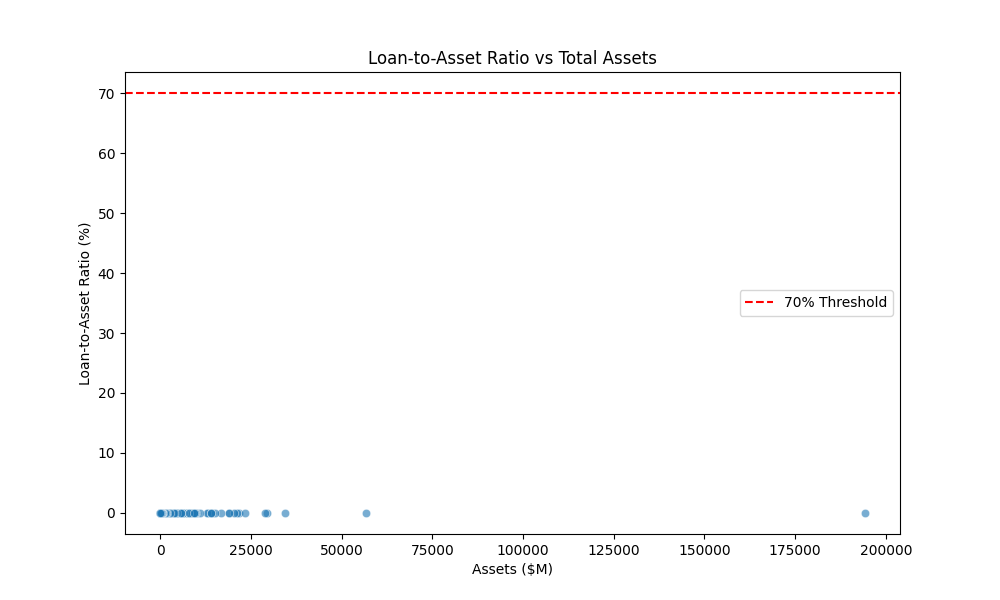

# Credit-Union-Financial-Health-Analyzer


A Python + SQL project analyzing real U.S. credit union financial data from NCUA Call Reports. It profiles data, validates records, runs SQL queries for business insights, computes key ratios, visualizes trends, and exports stakeholder-ready Excel reports.

Built to demonstrate skills relevant to data analysis, reporting, and problem-solving roles in financial services.

## Overview

This tool:
- Loads and validates NCUA quarterly Call Report data
- Uses SQL (via pandasql) to identify top-performing and high-growth credit unions
- Calculates financial ratios (e.g., loan-to-asset, net worth ratio)
- Generates visualizations for stakeholder presentations
- Exports multi-sheet Excel reports

**Goal**: Help teams answer questions like  
*"Which credit unions are financially strong or showing high growth potential?"*

## Skills Demonstrated
- SQL queries for business analysis
- Python (pandas) for data cleaning, validation, and feature engineering
- Basic statistical techniques (summary stats, ratios)
- Data visualization (matplotlib/seaborn)
- Reporting & dashboards (Excel export)
- Documentation & transparency (handling real data limitations)

## Data Source
- Public NCUA Quarterly Call Report (example: Q3 2025)
- Main file: FS220.txt (balance sheet summary)
- Merged with FS220C.txt (loans detail) for richer analysis
- Link: https://ncua.gov/analysis/credit-union-corporate-call-report-data/quarterly-data
**Note**: In this public export, loan and net worth fields appear zeroed (likely privacy masking). Assets data is fully populated and analyzed. In production, full internal data would be used.

## Demo Outputs

### Asset Distribution ($ Millions)

The distribution is heavily right-skewed, with most credit unions having total assets under $500 million, but a long tail of very large institutions (some exceeding $100 billion). This reflects the real-world structure of the U.S. credit union industry: thousands of small community-based CUs and a few very large national players (e.g., Navy Federal, State Employees'). 
**Business insight**: Opportunities for partnerships or services may be concentrated among mid-to-large CUs (assets $100M–$10B), as they have scale but are not yet dominated by the giants.


### Top 10 Credit Unions by Total Assets ($ Millions)

The largest credit unions dominate, with the #1 CU (likely Navy Federal) having assets ~$194B — roughly 3–4× larger than #2. The top 10 represent a significant portion of the industry's total assets.  
**Business insight**: These top players are likely key targets for financial technology solutions, risk management services, or lending partnerships — they have scale, but also complex needs.


### Loan-to-Asset Ratio vs Total Assets

 
In this dataset, loan-to-asset ratios are zero due to data masking in the public export. In real data, we'd expect most points clustered between 50–80% (typical for healthy CUs), with outliers indicating aggressive lending or conservative strategies. The red line at 70% is a common industry benchmark for balanced loan portfolios.  
**Business insight**: High ratios (>70%) could signal growth-oriented CUs (more lending activity), while low ratios might indicate conservative risk management or liquidity focus — useful for segmenting partners.


### Sample Excel Report
[Download credit_union_analysis_report.xlsx](credit_union_analysis_report.xlsx)  
(Sheets: Raw_Data, Statistics, Top_Assets_SQL, High_Growth_SQL)


**Data Limitation Note**: Loan and net worth fields appear zeroed in this public NCUA export (common privacy practice). The assets analysis remains robust and meaningful.


## How to Run
1. Clone the repo
2. Install dependencies:
   ```bash
   pip install pandas pandasql matplotlib seaborn openpyxl
